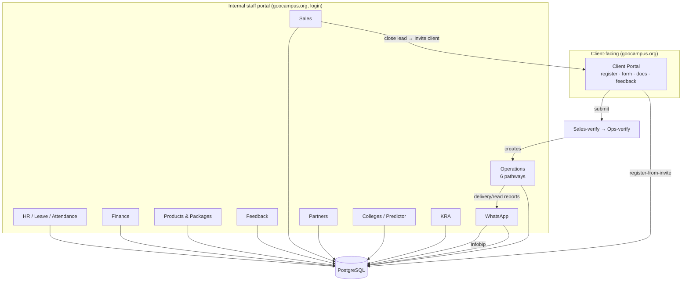
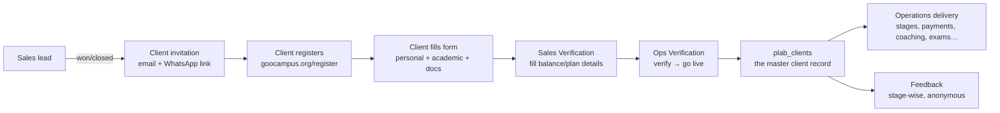

# GooCampus Portal — Architecture

The single source of truth for how the GooCampus internal + client portal is built.
Start here, then jump to [MAP.md](MAP.md) to find the code for any section, or a
`sections/*.md` file for a deep dive.

> **What this app is:** an internal operations + sales + HR portal for GooCampus
> (an education-services company helping Indian doctors pursue international medical
> pathways — USMLE / PLAB / AMC / etc.), plus a **client-facing portal** where clients
> register, upload documents, and give feedback.

---

## 1. Tech stack

| Layer | Choice |
|---|---|
| Language | Python 3 |
| Web framework | **Flask** (server-rendered Jinja2 templates — not an SPA) |
| Database | **PostgreSQL** (on Render) |
| DB access | thin wrapper in `db.py` — `get_db()` returns a connection whose `.execute(sql, params)` translates `?` placeholders → `%s` and uses a `RealDictCursor` (rows behave like dicts: `row['col']`) |
| File storage | **Cloudflare R2** (S3-compatible) for contracts/documents — see `core/storage.py`; plus local `static/uploads/` for some client docs |
| Email | **Resend** (`email_utils.py`), from `GooCampus <info@goocampus.in>` |
| WhatsApp | **Infobip** (template messages) — sender `15558246314` |
| Hosting | **Render** — two web services (live + staging), one shared Postgres |
| Frontend | Server-rendered Jinja templates + vanilla JS + inline styles. No build step. |

**No frontend build, no ORM, no microservices.** It is one Flask app (`app.py`, ~39k
lines) plus a growing set of extracted route modules under `routes/`.

---

## 2. Big picture



**The core business flow** (the spine of the whole app):



- **`client_registrations`** = the in-flight registration (invite → submitted).
- **`plab_clients`** = the master, ops-side client record (created at ops-verify).
  Despite the "plab" name it holds **all pathways** (scoped by a `pathway` column).

---

## 3. Domains & deployment

See [DEPLOY.md](DEPLOY.md) for the full detail. Summary:

- **Live portal: `https://goocampus.org`** (Render custom domain) — client login,
  registration, feedback, and the staff portal all live here. Also reachable at
  `https://goocampus-hr-portal.onrender.com`.
- **`goocampus.in` is a DIFFERENT site** (the public NEET Rank Predictor / marketing) —
  it is NOT the portal. Never use it for portal/client/feedback links.
- **Render services (shared DB):**
  - Live `srv-d7732b3uibrs73a4fj60` ← branch `main`
  - Staging `srv-d8bd6t4m0tmc73desvb0` ← branch `develop`
- Auto-deploy is flaky → after `git push`, trigger the deploy hook (see DEPLOY.md).

---

## 4. Code layout

```
goocampus-portal/
  app.py                 # ~39k lines — the monolith: most routes + all table DDL
                         #   (ensure_* functions create/migrate tables at boot)
  db.py                  # get_db() connection wrapper (? → %s, RealDictCursor)
  email_utils.py         # Resend send_email() + retry/backoff
  core/
    auth.py              # @login_required / @client_required / @admin_required / sales guards
    users.py             # get_user(), current user helpers
    helpers.py           # misc helpers
    lookups.py           # lookup_options helpers (get_lookup_options)
    registration.py      # per-pathway reg-number generator (GCUKIP/GCCSS/…)
    storage.py           # Cloudflare R2 upload/download
  routes/
    feedback.py          # Client Feedback system (forms, invites, results, bulk WhatsApp, delivery report)
    feedback_seed.py     # the 7 seed feedback forms (questions)
    verification_queues.py       # Sales-verify + Ops-verify queues
    internal_transfers_completion.py
    operations/          # Operations module (extracted, per-pathway + per-subsection)
      __init__.py        # register_operations_modules(app) — wires every ops module
      australia.py consulting.py uae.py portfolio.py training.py   # per-pathway dashboards + client detail
      {au,cs,uae,pf,tr}_*.py   # per-pathway sub-sections (payments, call_notes, academic, epic, …)
      call_notes_report.py     # shared Call Notes → Reports tab (all pathways)
      cross_pathway_add.py     # "Add to Training" etc. cross-pathway
      ngo.py, _form_lookups.py
  college/               # College Portal + Medical Predictor + NEET-PG (extracted module)
  templates/             # 404 Jinja templates
  static/                # CSS, JS, images, uploads
  docs/                  # ← you are here
```

**Why the monolith + modules split:** the app began as one `app.py`. Sections are being
**progressively extracted** into `routes/` modules (Operations and Feedback are done;
College is its own folder). New work should prefer a module; older sections still live in
`app.py`. `register_operations_modules(app)` (in `routes/operations/__init__.py`) is the
one place that wires all ops sub-modules at startup.

---

## 5. Startup / migrations

There is **no migration tool** (no Alembic). Instead, `app.py` runs a series of
**`ensure_*()` functions and `seed_*()` functions at import/boot** that:

- `CREATE TABLE IF NOT EXISTS …` for every table (idempotent),
- `ALTER TABLE … ADD COLUMN IF NOT EXISTS …` for new columns,
- seed lookup/config/default rows (idempotent, guarded by `_import_markers` / `app_migrations` where a one-time run is needed).

**Implication:** to add a column, add an `ALTER … ADD COLUMN IF NOT EXISTS` in the right
`ensure_*` block; it applies on next deploy. To change seeded data safely, use an
idempotent `seed_*` that self-heals (see `seed_fix_state_city_fields`, `seed_clean_junk_cities`).

---

## 6. The 11 staff sections + client portal

| Section | URL root | What it does | Deep dive |
|---|---|---|---|
| **Dashboard** | `/dashboard` | Landing / overview | — |
| **Sales** | `/sales` | Leads, closures, targets, verification, revenue report | [sections/sales.md](sections/sales.md) |
| **Operations** | `/operations` | 6 pathways, client delivery, all ops sub-sections | [sections/operations.md](sections/operations.md) |
| **HR** | `/hr`, `/wfh`, `/official-travel` | Attendance, leave, WFH, travel, holidays, employees | [sections/hr-leave-attendance.md](sections/hr-leave-attendance.md) |
| **KRA** | `/kra` | Goals / ratings per employee | [sections/hr-leave-attendance.md](sections/hr-leave-attendance.md) |
| **Finance** | `/finance` | Budget, revenue streams, projection, product economics | [sections/finance.md](sections/finance.md) |
| **Partners** | `/partners`, `/partner` | Partner accounts, leads, partner portal | [sections/partners-college.md](sections/partners-college.md) |
| **Colleges** | `/college`, predictor | College Portal, Medical Predictor, NEET-PG | [sections/partners-college.md](sections/partners-college.md) |
| **Company** | `/company` | Company-level settings/info | — |
| **WhatsApp** | `/whatsapp` | Campaigns, contacts, templates (Infobip) | [sections/feedback.md](sections/feedback.md) (WA infra) |
| **Clients** | `/admin/clients`, Feedback | Client management + the Feedback system | [sections/feedback.md](sections/feedback.md) |
| **Client Portal** | `/client/*`, `/register`, `/feedback/<token>` | Client-facing: register, form, docs, feedback | [sections/client-portal-registration.md](sections/client-portal-registration.md) |
| **Products & Packages** | `/products`, `/admin/packages` | Product catalogue + per-plan packages/services | [sections/packages-products.md](sections/packages-products.md) |

Also: **country landing pages** (public marketing/lead pages) — `/germany-pathway`,
`/russia`, `/georgia`, `/vietnam`, `/uzbekistan`, `/jss-mauritius`, NEET-PG — capture
leads into `*_leads` tables.

---

## 7. Access control (security backbone)

- **Two user worlds:** internal **employees** (staff, `employees` table, `is_admin` flag,
  session cookie) and **client_accounts** (clients, separate login at `/client/login`).
  Partners are a third (`partners` + OTP login).
- **Decorators** (in `core/auth.py`): `@login_required` (staff), `@client_required`
  (client), `@admin_required` (staff admin), `@sales_crm_required` / `@sales_write_required`.
- **Access Master** = a per-section / per-subsection permission grid. `can_access(section,
  subsection, action)` gates non-admin staff; **admins bypass all checks** (this is why a
  permission gap is invisible to the founder but breaks for a normal user — see
  `feedback_new_ops_section_wiring` memory).
- Full detail in [sections/access-permissions.md](sections/access-permissions.md).

---

## 8. Key cross-cutting conventions & gotchas

- **DB rows are dicts:** `row['col']`, `fetchone()['id']` (RealDictCursor) — never `row[0]`.
- **`%` in SQL collides with param substitution.** `LIKE 'inst%'` throws `IndexError:
  tuple index out of range`. Escape as `%%`, pass the pattern as a bound `?` param, or
  filter in Python. (Bit us on `information_schema` + `Fill details`.)
- **Swallowed query errors must `conn.rollback()`** or the whole transaction aborts and
  every later query in that request fails.
- **Timezone:** Postgres stores UTC. India is IST (UTC+5:30, no DST). Format for display
  with an IST offset (see feedback `_ist_str`). "days ago" style deltas are UTC-to-UTC so
  they're fine.
- **`ops_call_notes.call_date` is TEXT** — never `ORDER BY call_date` for recency; use
  `created_at` / `id`.
- **Pathway scoping:** ops tables use `COALESCE(pathway,'plab') = ?`.
- **GST:** always 18%. Packages stored **ex-GST** (base); installments entered **incl-GST**
  and split ÷1.18.
- **Nav has separate admin vs non-admin branches** — add menu items to BOTH.
- See [../MEMORY reference files] and [DATA-MODEL.md](DATA-MODEL.md) for more.
