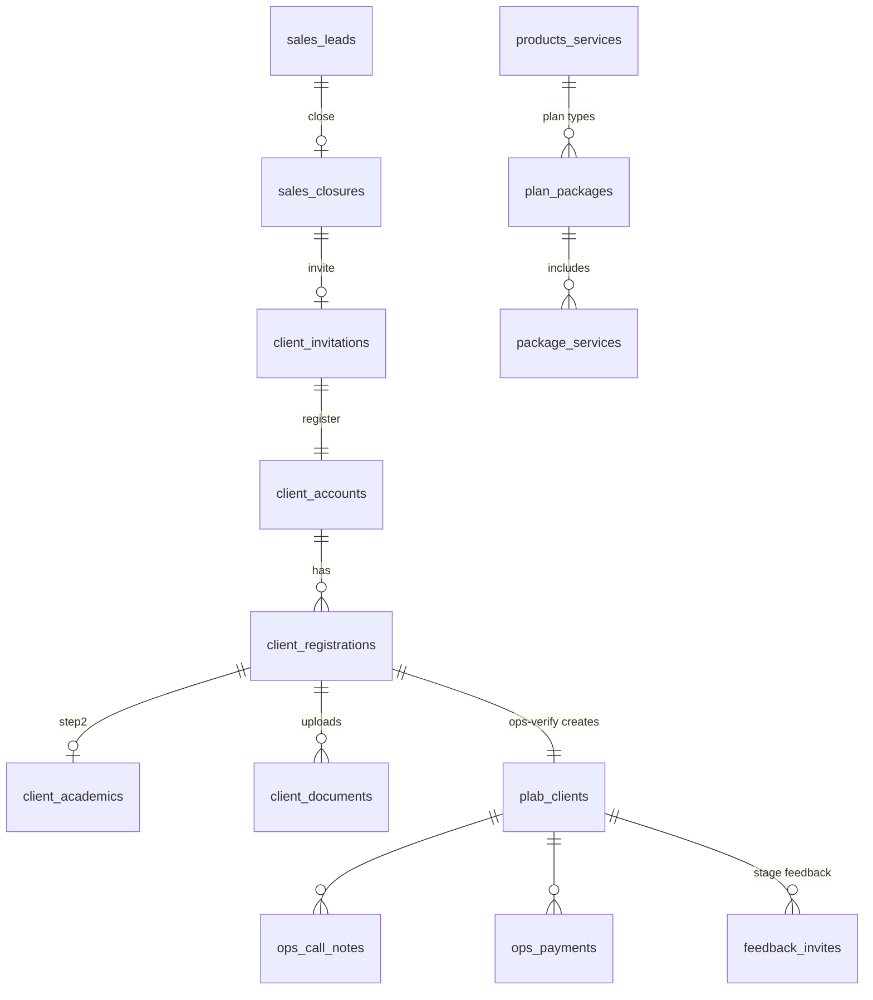

# Data Model

~150 tables (all `CREATE TABLE IF NOT EXISTS` in `app.py` / module `ensure_*` functions).
This lists the **important** ones and how they relate. Rows are dict-like (`row['col']`).

---

## The client spine

## Key tables at a glance

| Table | Purpose | Key columns |
|---|---|---|
| `employees` | staff | id, name, emp_code, is_admin, is_active, department, reporting_to, carry_forward |
| `client_accounts` | client login | id, mobile (unique), password_hash, last_login |
| `client_registrations` | in-flight registration | account_id, product_id, plan_type, registration_number, form_status, sales_completed, ops_status, package_amount, discount_allowed, final_package, inst1..4_* |
| `client_academics` | step-2 answers | registration_id, img_fmg, mbbs_*, internship_*, working_*, speciality_* |
| `plab_clients` | **master client record** (all pathways) | registration_number (unique), pathway, product_id, plan_type, package_amount, discount_allowed, final_package, counsellor, current_stage, joined_stage, account_status, total_paid |
| `products_services` | product catalogue | name, type, product_cost, sale_price, cost/sale_currency, project_id, revenue_stream_id, pathway |
| `plan_packages` | per-plan package | product_id, plan_type, package_amount (gross), plan_cost, summary |
| `lookup_options` | all dropdowns | category, label, value, product_name, pathway, sort_order, is_active |
| `user_section_permissions` | **Access Master** | subject_type, subject_id, main_section, sub_section, can_view/edit/add |
| `sales_leads`, `sales_lead_stages`, `sales_closures`, `sales_targets`, `sales_team` | sales | (see [sales.md](sections/sales.md)) |
| `ops_*` (18 tables) | ops sub-sections | registration_number, pathway, … (see [operations.md](sections/operations.md)) |
| `leave_records`, `attendance_logs`, `wfh_requests`, `official_travel_requests`, `holidays` | HR | (see [hr-leave-attendance.md](sections/hr-leave-attendance.md)) |
| `kra_templates`, `kra_template_items`, `kra_assignments`, `kra_monthly_ratings` | KRA | |
| `budget_categories`, `budget_entries`, `salary_items`, `subscription_items`, `revenue_streams`, `projects` | finance | (see [finance.md](sections/finance.md)) |
| `feedback_forms`, `feedback_questions`, `feedback_invites`, `feedback_responses`, `feedback_answers` | feedback | (see [feedback.md](sections/feedback.md)) |
| `partners`, `partner_leads`, `partner_b2b_leads`, `partner_invitations` | partners | |
| `colleges`, `college_courses`, `college_fee_structure`, `mbbs_cutoffs`, `neetpg_*` | college module | |
| `wa_campaigns`, `wa_contacts`, `wa_contact_lists`, `wa_templates`, `wa_messages` | WhatsApp section | |
| `states`, `cities` | geo master | |
| `internal_transfers`, `internal_transfer_items` | cross-pathway moves | |
| `installment_approvals`, `refunds`, `ops_payments` | money | |
| `employee_onboarding` | new-hire staging (HR basics + hire's fields) | employee_id, employee_code, personal/emergency fields, bank_*, photo_filename, personal_email, status, invite_token, timestamps |
| `employee_onboarding_experience`, `employee_onboarding_documents` | onboarding sub-rows | onboarding_id, (experience fields) / (doc_type, r2_key, filename) |
| `employee_experience`, `employee_documents` | **employee-keyed** profile data (all staff) | employee_id, … / employee_id, doc_type, r2_key |
| `pg_users` | goocampus.in doctor record | mobile (unique), name, email, neet_pg_year/rank, target_speciality, college, state/city, photo, session_token |
| `pg_plans`, `pg_plan_features` | .in plans + plan×feature matrix | price, compare_at, badges / plan_id, feature_key, value |
| `pg_subscriptions` | doctor's active plan | pg_user_id, plan_id, status, expires_at, price_paid, coupon, payment_ref, source |
| `pg_orders` | Razorpay order ledger | pg_user_id, plan_id, razorpay_order_id, amount, coupon, status, payment_id, subscription_id |
| `pg_coupons`, `pg_coupon_redemptions`, `pg_usage_items` | .in coupons + usage quotas | (see [goocampus-in.md](sections/goocampus-in.md)) |

## Conventions & gotchas

- **RealDictCursor:** always `row['col']` / `fetchone()['id']`, never `row[0]`.
- **`%` in SQL** collides with param substitution → escape `%%` or bind as `?`.
- **Swallowed query errors need `conn.rollback()`** or the whole request's transaction aborts.
- **Text date columns:** `ops_call_notes.call_date`, `plab_clients.registration_date`,
  `ops_payments.payment_date` (some) are **TEXT** — don't order/compare as dates; use `created_at`/`id`.
- **Pathway scoping:** `COALESCE(pathway,'plab') = ?` on ops_* tables.
- **GST:** packages ex-GST (base); installments incl-GST, split ÷1.18.
- **No FK-enforced mutual exclusivity** on `budget_entries` (exactly-one-of is enforced in code).
- **Migrations = `ensure_*` / `seed_*` at boot** (idempotent `ADD COLUMN IF NOT EXISTS`); one-time
  data migrations guard on `app_migrations` / `_import_markers`.
