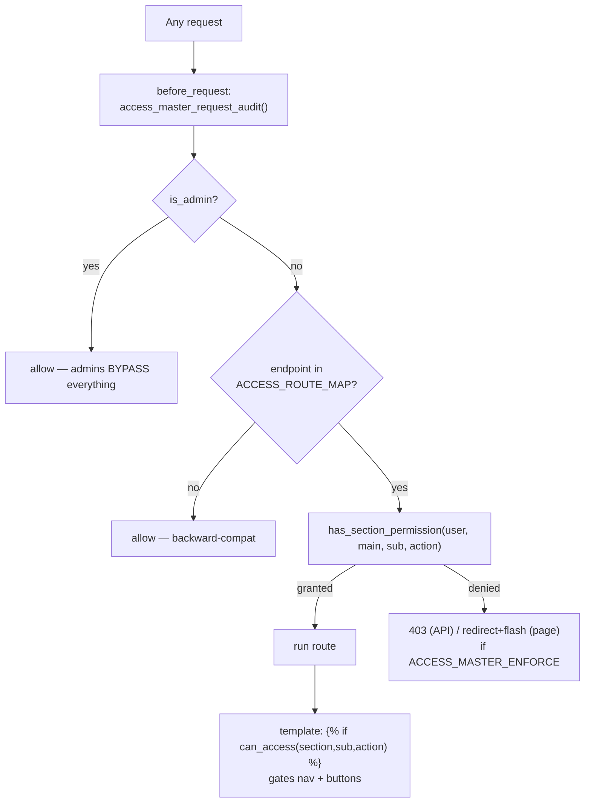

# Auth, Roles & Access Master (the security backbone)

How login, user types, roles, and per-section permissions work. **Read this before
touching anything permission-related** — a wrong grant either locks staff out or exposes data.

---

## Login & sessions

| User world | Login | Session flag | Table |
|---|---|---|---|
| **Employees** (staff) | `/login` (~L505) — `emp_code` + password (SHA256), `is_active=1` | `user_id`, `is_admin`, `emp_code` | `employees` |
| **Clients** | `/client/login` (~L975) — mobile + password | `is_client` | `client_accounts` |
| **Partners** | `/partner-login` (~L703) — email + password, `status='Active'` | `is_partner` | `partners` |

- Session: **30-day rolling**, `permanent=True`, `SESSION_REFRESH_EACH_REQUEST=False` (issued once
  → no session bleed via shared proxies). Cookies: `Secure` + `HttpOnly` + `SameSite=Lax`
  (config ~L54–61). An after-request hook adds `Cache-Control: private, no-store` on authenticated
  responses. Logout `/logout`.

## Decorators (`core/auth.py`, coarse gate)

- `@login_required` — staff logged in (else → `/login`).
- `@admin_required` — logged-in employee AND (`is_admin=1` **or** has ≥1 `user_section_permissions`
  row with `can_view=1`). So non-admins with grants pass this coarse gate; the fine-grained audit
  (below) then enforces the specific section.
- `@client_required` — `session['is_client']`.
- `@sales_crm_required` / `@sales_write_required` — sales access.

## Sales roles

Table `sales_team` (`employee_id`, `manager_employee_id`, `role`). `get_sales_role(user)` (~L25926):
**admin** (is_admin) > **viewer** (read-only, `module_access.access_level='admin_view'`) >
**manager** (sees self + direct reports) > **rep** (sees only self). `get_visible_sales_employee_ids(user)`
enforces the who-can-see-whom scoping.

## Access Master — the permission grid

**This is THE authorization system.** Table **`user_section_permissions`**:
`subject_type` (employee/partner), `subject_id`, `main_section`, `sub_section`, `can_view`,
`can_edit`, `can_add`.

**Three enforcement layers:**
1. **`has_section_permission(subject, main, sub, action)`** (~L35472) — the core check. Admin →
   always True; else looks up the flag in `user_section_permissions`. Errors → False.
2. **`access_master_request_audit()`** (before_request hook, ~L35422) — maps `request.endpoint`
   via **`ACCESS_ROUTE_MAP`** (~L34901, 400+ endpoints → `(main, sub, action)` via the `_ap()`
   helper) and denies unmapped-safe. `ACCESS_MASTER_ENFORCE = True` (~L34893) = deny; False =
   audit-only.
3. **`can_access(main, sub, action)`** — Jinja global (~L35326) used in templates to hide nav items
   / buttons a user can't use.

**The catalogue** — `ACCESS_SECTION_CATALOG` (~L31914) defines ~14 main sections + ~80 sub-sections
(every ops pathway + its sub-sections, sales, hr, kra, finance, company, colleges, whatsapp,
clients, partner_portal). The **Access Master admin UI** is `/admin/access-master` (~L35758,
by-person + by-section modes), `/admin/access-master/summary` (read-only overview),
`/admin/access-master/save`.

## Navigation

- `base.html` = top navbar. `section_sidebar_base.html` = the two-panel section layout; each section
  has a `*_sidebar_base.html` (hr/sales/finance/ops/kra/company/colleges/partners/wa/clients) that
  fills ``.
- **Nav has separate admin vs non-admin branches** — add a menu item to BOTH. Non-admin items are
  gated with ``. Debug by rendering as a non-admin (not a cache issue).
- Context vars: `active_section`, `active_ops_page`.

## Gotchas (critical)

- **Admins bypass ALL checks.** A missing/incorrect grant is invisible to the founder (an admin)
  but breaks for a normal staff member. **Always test permission changes as a non-admin.** When
  adding/changing a section, wire ALL factors: `ACCESS_SECTION_CATALOG`, `ACCESS_ROUTE_MAP`, the
  sidebar, the dashboard card, lookups. (See `feedback_new_ops_section_wiring`.)
- **Unmapped endpoints are silently allowed** (backward-compat) — a new sensitive route without an
  `ACCESS_ROUTE_MAP` entry is ungated until you add one.
- The founder's portal login is the **"Admin"** account (`employees` id=1). `info@goocampus.in` is
  the **Claude-session + Resend sender**, NOT a portal login.
