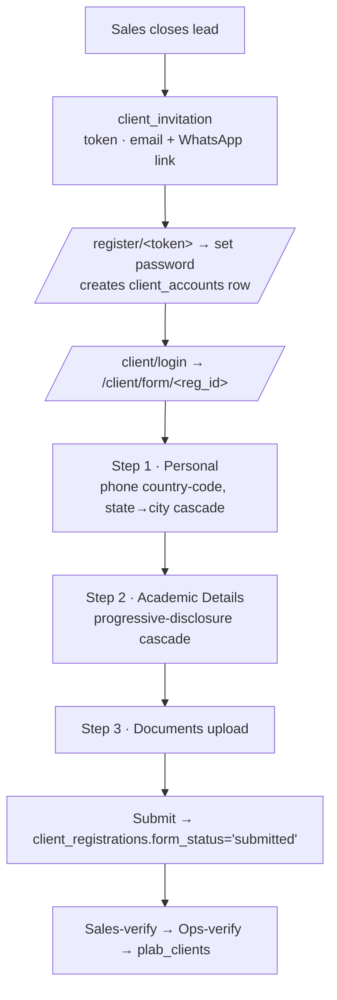
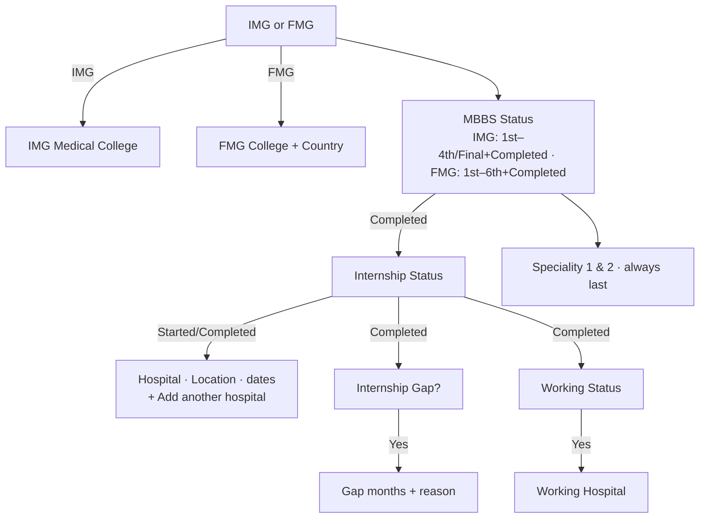

# Client Portal & Registration

The **client-facing** side (on `goocampus.org`): a client receives an invite, sets a password,
fills a multi-step registration form (personal + academic + documents), and later logs in to a
portal to see their plan, payments, upload their photo, and give feedback. Mostly in `app.py`
(client routes `/client/*`, `/register`) + `core/registration.py`.

---

## The registration flow

## Key pieces

| Thing | Where |
|---|---|
| Invite create + send | `client_invitations` table; `_send_client_invite_wa` (app.py ~L3030) |
| Register (set password) | `/register/<token>` → creates `client_accounts` (mobile + password_hash) |
| The form | `templates/client_form.html`; route `/client/form/<reg_id>` (app.py ~L1780) |
| Form config | `client_form_configs` (per-product, role='client', is_visible) — which fields render, per step, in what order (`display_order`) |
| Dashboard | `templates/client_dashboard.html` — plan/counsellor card, installments (received/due, GST), photo upload, refund policy |
| Feedback | `/feedback/<token>` — see [feedback.md](feedback.md) |

## Config-driven form

Fields come from `client_form_configs` (not hardcoded). `_CR_FORM_COLS` (step 1 personal) and
`_CA_FORM_COLS` (step 2 academic) whitelist which columns a submit may write. Rendered by the
`render_field` Jinja macro (each wrapper tagged `data-fname`).

### Phone fields (country code)
`mobile`, `whatsapp`, `whatsapp2`, `father_phone`, `mother_phone` render a **country-code dropdown**
(grouped by region, shows country name + dial code) + a separate number box; combined into a hidden
field. India (+91) = exactly 10 digits; others digits-only, no max. JS: `initPhoneFields` +
`GC_COUNTRIES`.

### State → City cascade
`state` + `city` are selects; picking a state loads cities via `/client/api/cities?state=<name>`
(public). Normalised to `db:states` / `db:cities` by a boot seed (`seed_fix_state_city_fields`).

### Academic Details cascade (progressive disclosure)
`initAcademicCascade` in client_form.html shows/hides fields based on prior answers, and strips
`required` from hidden fields so the form still submits:

Field order enforced by boot seed `seed_academic_field_order()`. Drivers (img_fmg, mbbs_status,
internship_status, gap, working) are `select` type, options normalised in JS.

## Client portal (post-login)

`client_dashboard.html` — white GooCampus logo navbar; plan/product + counsellor cards; installments
(Amount + 18% GST = Total, received vs due); **Upload Photograph** (falls back to `client_documents`
if the client isn't yet in `plab_clients`, i.e. pre-verify); refund-policy agree/sign (emailed copy).

## Tables

`client_accounts` (login), `client_registrations` (the in-flight registration: personal + academic
cols, `form_status`, `sales_completed`, `ops_status`, product_id, plan_type, package/discount/final,
installments), `client_academics` (step-2 answers), `client_documents` (uploads by registration_id),
`client_doc_requests`, `client_invitations`, `client_form_configs`, `client_agreements` (refund
policy), `client_notifications`, `client_onboarding`, welcome-kit tables.

## Gotchas
- **Domain:** all client links must use `goocampus.org` (not goocampus.in).
- Photo upload pre-verify: `/client/upload-plab-doc` needs a `plab_clients` row (created at
  ops-verify) — it now falls back to `client_documents` by registration_id before verify.
- `client_form_configs` seed **skips products that already have a config** — to change a field
  definition on existing products you need a force-normalising boot seed (see the state/city fix).
- `registration_date` (plab_clients) is TEXT.
