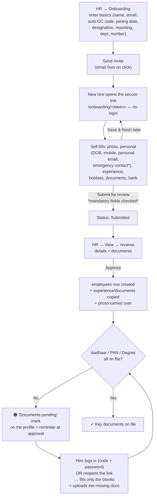

# Employee Onboarding

HR brings a new hire on board by entering only the basics, emailing them a secure
link, and letting them fill in the rest themselves. HR reviews and approves, which
creates the real `employees` record. Everything the hire uploads (documents, photo)
lives in **Cloudflare R2** so it survives deploys.

Added 2026-08 (`/admin/onboarding` + public `/onboarding/<token>`). Data-collection
only — approval does **not** create a portal login by itself; the employee gets the
usual default credentials (code + first-name), same as the classic "Add Employee".

## The flow

## What HR does

- **`/admin/onboarding`** (HR sidebar → *Onboarding*, admin-only). Enter the basics;
  the **Employee Code is auto-suggested** as the next `GC###` (counts pending invites
  too, so back-to-back adds don't collide). Click **Send Invite** to email the link.
  **"+ Add New Employee"** on *Manage Employees* points here; the old quick-add is kept
  only as **"+ Add Past Employee"** (historical/exited staff, who already have a code).
- **View → Approve & Add to Employees** — creates the `employees` row and copies the
  hire's experience + documents into the employee-keyed tables. If the 3 key documents
  aren't on file, a reminder is flashed and the profile shows the orange mark.
- **📣 Send Welcome Announcement to Team** — a deliberate button (never auto-fires) that
  emails all active employees + the new member.
- **Delete** — removes the onboarding record + its documents; a test employee with no
  history is hard-deleted, otherwise the employee is deactivated (history preserved).

## What the new hire does

- Opens the **secure token link** (no login). The token *is* the key — they can
  **Save & finish later** and return to the same link anytime.
- **Mandatory to submit** (lenient on save): personal mobile, DOB, personal email,
  emergency contact (name/number/relation). Documents are **optional** to submit.
- **After submitting/approval** the link stays usable in "fill-the-blanks" mode: fields
  already entered are **locked**, only blanks + missing documents remain editable.
- Alternatively, once approved they **log in (employee code + password) → My Profile**
  and complete the blank fields + upload any missing documents there.

## The "Documents pending" rule

`aadhaar`, `pan`, `degree` are the 3 **required** documents (`ONBOARDING_REQUIRED_DOCS`).
They never block submission or approval, but until all three are on file the employee's
profile and the onboarding review show a persistent **🟠 Documents pending** badge; once
complete it turns into a green **✓ Key documents on file**. `_missing_required_docs()`
computes it from `employee_documents`.

## Data model

| Table | Holds |
|---|---|
| `employee_onboarding` | The staging + tracking record: HR basics + the hire's personal/bank fields, `status` (created→invited→in_progress→submitted→completed / cancelled), `photo_filename`, `personal_email`, `employee_id` (set at approval), timestamps |
| `employee_onboarding_experience` | Work-experience rows keyed to `onboarding_id` |
| `employee_onboarding_documents` | Uploaded docs (R2 keys) keyed to `onboarding_id` |
| `employee_experience` | **Employee-keyed** experience — used by the profile for ALL staff (old + new) |
| `employee_documents` | **Employee-keyed** documents (R2) — used by the profile for ALL staff |
| `employees` (added cols) | `blood_group`, `hobbies`, `official_number`, `personal_email`, `bank_*` |

Rich data lives in the employee-keyed tables so old employees get the same profile
sections (empty, editable). On approve, the onboarding experience/documents are copied
into them; later gap-fills are synced too (`_sync_onboarding_docs_to_employee`).

## Routes & files

- Public: `GET/POST /onboarding/<token>` (`onboarding_public`), template `onboarding_form.html`.
- Admin: `/admin/onboarding` (list+create), `/admin/onboarding/<id>` (review),
  `/admin/onboarding/<id>/send-invite|approve|cancel|announce|delete`,
  `/admin/onboarding/doc/<doc_id>` (R2 presigned download).
  Templates `admin_onboarding.html`, `admin_onboarding_detail.html`.
- Employee profile: `/admin/employee/<id>` (view) + `/edit` show/edit all sections;
  `/admin/employee/<id>/docs/upload|doc/<id>|doc/<id>/delete`. Self-service: `/profile`.
- Photos: `/profile/upload-photo` + `/admin/employee/<id>/upload-photo` → R2; served via
  the `/static/photos/<file>` override (`serve_employee_photo`). See
  [Render ephemeral disk](../DEPLOY.md).
- All onboarding tables self-create at request time via `_ensure_employee_onboarding(conn)`.

## Gotchas

- **Photos must go to R2.** Render's disk is wiped on every deploy; disk-saved photos
  vanish. `_save_employee_photo_bytes()` stores to `employee_photos/<code>.<ext>`; the
  `/static/photos/` route override presigns from R2 so every screen works unchanged.
- **Request-time DDL.** New columns/tables are added on first request (`ALTER … IF NOT
  EXISTS`) because Render cold-start boot DDL can silently skip.
- **Welcome announcement is manual** so approving a *test* profile never emails the whole
  company.
