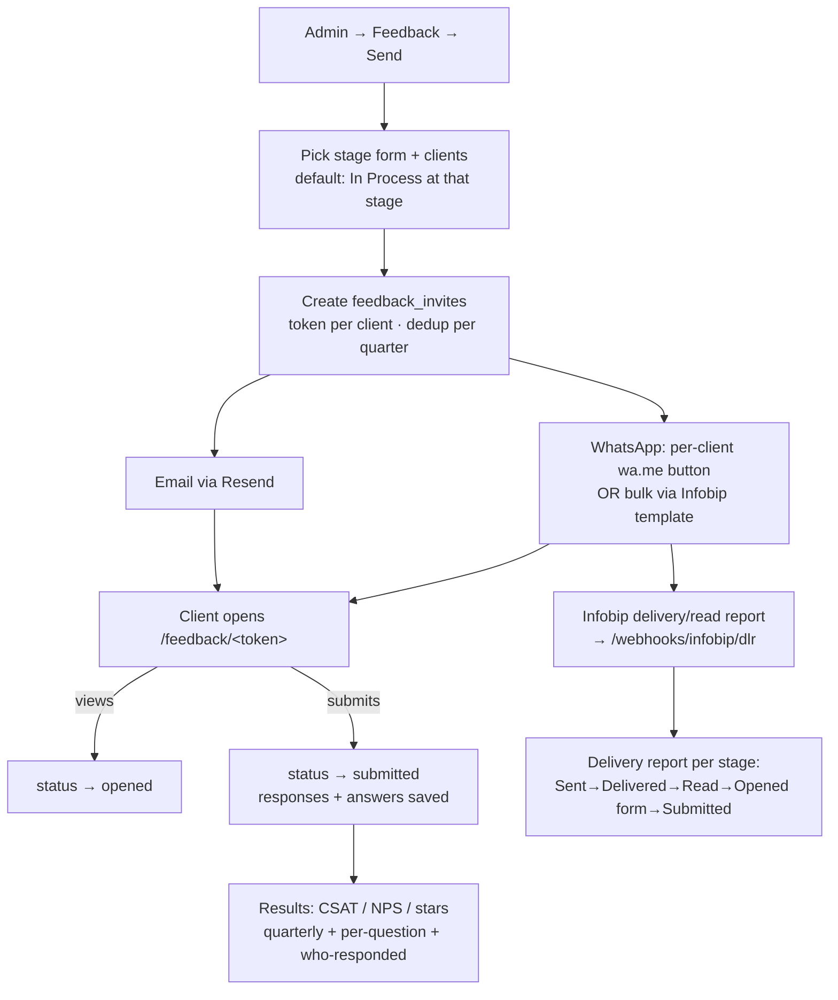

# Client Feedback + WhatsApp/Email infrastructure

**Code:** `routes/feedback.py` (+ `routes/feedback_seed.py`) · **Templates:**
`feedback_public.html`, `admin_feedback*.html` · **Nav:** under **Clients**, gated by
Access Master `clients`/`feedback`.

---

## Purpose

Measure the **Operations team's performance** from the client's point of view,
**stage by stage**, **anonymously** (the form collects no identity, so clients answer
openly — but each link carries a unique token tied to a registration number, so internally
we know who responded).

## Data model

| Table | Role |
|---|---|
| `feedback_forms` | one form per pathway+stage (id, pathway, stage_key, title, match_stages, thank_you_message, `last_wa_bulk_at`, `last_wa_bulk_count`) |
| `feedback_questions` | questions per form (qtype: star / scale(NPS 0-10) / choice / short / long) |
| `feedback_invites` | one row per send: `token` (uuid), form_id, registration_number, client_name, mobile, email, status (`sent`/`opened`/`submitted`), `sent_at`/`opened_at`/`submitted_at`, `quarter_key`, `email_status`, `wa_sent_at`, **`wa_message_id`/`wa_status`/`wa_delivered_at`/`wa_read_at`** (WhatsApp delivery funnel) |
| `feedback_responses` + `feedback_answers` | submitted answers |

7 seed forms (`feedback_seed.py`), questions transcribed verbatim from the founder's Fillout forms.

## Flow

## Key routes (registered in `register_routes(app)` at bottom of feedback.py)

| URL | Function | What |
|---|---|---|
| `/feedback/<token>` | `feedback_public` | public form (no login); GET renders, POST submits |
| `/admin/feedback` | `admin_feedback` | dashboard: overall CSAT/NPS/stars + per-form cards |
| `/admin/feedback/send` | `admin_feedback_send` (+ `_post`) | pick form → clients → send |
| `/admin/feedback/results/<form_id>` | `admin_feedback_results` | KPIs, per-question, who-responded drawer |
| `/admin/feedback/followup/<form_id>` | `admin_feedback_followup` | Sent/Opened tabs, re-send, WhatsApp nudge |
| `/admin/feedback/resend/<invite_id>` | `admin_feedback_resend` | re-send email (fix address inline) |
| `/admin/feedback/wa-sent/<invite_id>` | `admin_feedback_wa_sent` | mark per-client WhatsApp sent |
| `/admin/feedback/wa-bulk/<form_id>` | `admin_feedback_wa_bulk` | **bulk WhatsApp** to the follow-up list |
| `/admin/feedback/delivery/<form_id>` | `admin_feedback_delivery` | WhatsApp delivery/read funnel report |
| `/webhooks/infobip/dlr` | `infobip_dlr_webhook` | Infobip delivery/read callback (public) |

## Metrics

- **CSAT** = % of star answers that are 4–5.
- **NPS** = %promoters (9–10) − %detractors (0–6) on the 0–10 "recommend" scale.
- **Quarterly view:** each send auto-stamped with the reporting quarter (Indian FY derived
  from send date). `_metrics()`, `_quarter_for()`, `_days_ago()`, `_ist_str()`.

## Bulk WhatsApp (Infobip)

- Each dashboard card has a green **"WhatsApp follow-up list (N)"** button → sends the
  approved Utility template **`registered_client_feedback_request`** (lang `en_GB`) to every
  pending client (not yet submitted, has mobile), **each with their own unique link**.
- Payload per message: `templateData.body.placeholders = [client_name, form.title]`,
  `buttons = [{type:'URL', parameter: token}]`. The template's fixed base URL is
  `https://goocampus.org/feedback/`, so the button parameter is **just the token**.
- **Batched** (`_send_feedback_wa_batch`, chunks of 50). Sets `wa_sent_at` + `wa_message_id`;
  a `callbackData` = invite id + `notifyUrl` lets the DLR webhook update
  `wa_status`/`wa_delivered_at`/`wa_read_at` in ~real-time.
- **Safety guard:** server blocks re-blasting a stage within 2h unless `force=1`; the UI
  confirm warns "already sent on <date>, re-send anyway?".
- **Delivery report** funnel: Read(WhatsApp) undercounts (recipient read-receipts); **Opened
  form** (link click) is the reliable engagement signal.

## Gotchas

- Dedup on send (skip already-submitted / already-sent this quarter) — an earlier bug
  inflated "700+ sent"; distinct-client counting fixed it.
- **Domain:** links MUST be `goocampus.org` (not `goocampus.in`). The template's button URL
  is baked in at Meta-approval time — changing it needs re-approval.
- Delivery tracking only works for sends made **after** the DLR feature shipped (older sends
  carry no callback).

---

## Shared WhatsApp + Email infra

- **Email:** `email_utils.send_email()` (Resend). Retries on Resend's 2 req/sec rate limit
  (429) with 0.7/1.4/2.1s backoff so batch sends self-throttle. `RESEND_API_KEY` env var.
- **WhatsApp (Infobip):** template send to `https://{INFOBIP_BASE_URL}/whatsapp/1/message/template`,
  auth header `App {INFOBIP_API_KEY}`. Used by: client registration invite
  (`_send_client_invite_wa` in app.py ~L3030), feedback bulk send, and the WhatsApp section
  campaigns (`wa_*` tables). Rate limit ~thousands/req but chunk to be safe.
