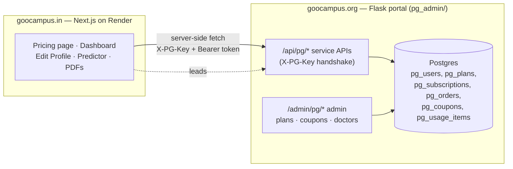

# goocampus.in — the doctor platform (NEET-PG)

`goocampus.in` is a **separate public website** (Next.js on Render) for Indian doctors
preparing for NEET-PG — mentor directory, a rank predictor, a PDF library, and paid
plans. It is **not** the internal portal (`goocampus.org`); it has its own repo
(`goocampus-pg`) and its own session.

The two apps share one brain: **all the data + business logic live on the portal**
(`goocampus.org`, in the `pg_admin/` module), and the goocampus.in site calls the
portal's `/api/pg/*` service APIs. This doc explains the split and the two flows that
were finished recently: the **two-way profile sync** and the **Razorpay checkout**.

## The 3-system split



- **Auth:** doctors log in on goocampus.in with a **WhatsApp OTP** (`/api/pg/otp/send`
  + `/api/pg/otp/verify`), which returns a 30-day Bearer token stored in an httpOnly
  cookie. (No email login; the .in site sends no email itself.)
- **Every** `/api/pg/*` call carries `X-PG-Key` (= the portal's `PG_API_KEY`, server-side
  only) and, for doctor-specific calls, `Authorization: Bearer <token>`.
- **Admin** configures everything under `/admin/pg/*` on the portal: plans, features,
  coupons, and the registered-doctors screen. Nothing is hard-coded on the site.

## Plans, features & entitlements

A **plan** grants a set of **features**; a feature is on/off or a capped number
(e.g. "PDF documents = 3"). The free plan is what a logged-in doctor gets with no
purchase. The engine (`pg_admin/data/entitlements.py`) has a single gate — `check()` /
`consume()` — and usage is bucketed by `period_key` (no cron to reset quotas).

Key APIs (full contract: `pg_admin/PRICING_API_CONTRACT.md`):
`GET /api/pg/plans` (pricing cards), `GET /api/pg/entitlements` (what to show/grey out),
`POST /api/pg/entitlements/consume` (call the instant a gated thing is opened),
`POST /api/pg/coupons/validate` (price a coupon, read-only).

## Two-way profile sync (LIVE 2026-08-04)

The doctor's **Edit Profile** on goocampus.in and the **`/admin/pg/users`** admin screen
are the **same `pg_users` record**, rendered from a shared blueprint.

- `GET /api/pg/profile` → `{fields:[blueprint], values:{…}}` — the site renders the form
  by looping over `fields` (nothing hard-coded), so **adding a field to the portal
  blueprint makes it appear on goocampus.in automatically**.
- `POST /api/pg/profile` → saves the editable fields (whitelisted to the blueprint).
- Blueprint = `PG_PROFILE_BLUEPRINT` in `pg_admin/routes/api.py`
  (name, email, mobile[read-only], neet_pg_year/rank, target_speciality, college,
  state, city, photo).

## Razorpay checkout (LIVE 2026-08-04)

Paying starts a **subscription** to a paid plan (and burns any coupon). The Razorpay
**secret lives only on the portal** — it never reaches the browser.

```mermaid
sequenceDiagram
    participant D as Doctor (browser)
    participant IN as goocampus.in (server action)
    participant ORG as portal /api/pg/checkout
    participant RZP as Razorpay

    D->>IN: Buy plan (plan_id, coupon?)
    IN->>ORG: POST /create-order (X-PG-Key + Bearer)
    ORG->>ORG: price = plan − coupon; make pg_orders row
    ORG->>RZP: create order (secret, server-side)
    RZP-->>ORG: order_id
    ORG-->>IN: {order_id, amount, key_id(public), prefill}
    Note over ORG,IN: coupon covers it fully → {free:true}<br/>subscription activated, no charge
    IN-->>D: open Razorpay checkout.js (key_id, order_id)
    D->>RZP: pays in the popup
    RZP-->>D: {payment_id, order_id, signature}
    D->>IN: verify(payment_id, order_id, signature)
    IN->>ORG: POST /verify (X-PG-Key + Bearer)
    ORG->>ORG: HMAC-check signature → start pg_subscriptions<br/>burn coupon → mark pg_orders paid
    ORG-->>IN: {ok, subscription_id}
    IN-->>D: success → entitlements unlock
```

- **Portal** (`pg_admin/routes/api.py`): `POST /api/pg/checkout/create-order` and
  `POST /api/pg/checkout/verify`. Uses the Razorpay REST API via `requests` (no SDK);
  signature verified with stdlib HMAC-SHA256. New `pg_orders` ledger table. Verify is
  idempotent.
- **goocampus.in** (`goocampus-pg` repo): `src/app/dashboard/checkout-actions.ts` (server
  actions) + `src/components/dashboard/PlanPurchase.tsx` (loads `checkout.js`, opens the
  popup with the `key_id` from the response, verifies on success). No `NEXT_PUBLIC`
  Razorpay key needed — the public key id comes from the create-order response.
- **Env (Render):** `RAZORPAY_KEY_ID` + `RAZORPAY_KEY_SECRET` on the **goocampus.org**
  service only. The .in service just needs `PORTAL_API_BASE` (=https://goocampus.org) +
  `PORTAL_API_KEY` (=`PG_API_KEY`), already set.

## Data model (portal side, `pg_admin/data/`)

| Table | Holds |
|---|---|
| `pg_users` | The doctor record (mobile, name, email, NEET year/rank, speciality, college, state/city, photo, session_token) — same row the .in profile edits |
| `pg_plans` / `pg_plan_features` | Plans (price, badges, features) and the plan×feature matrix |
| `pg_subscriptions` | A doctor's active plan (status, expires_at, price_paid, coupon, payment_ref, source) |
| `pg_orders` | Razorpay order ledger (order_id, amount, coupon, status, payment_id, subscription_id) |
| `pg_coupons` / `pg_coupon_redemptions` | Coupon rules + the redemption ledger |
| `pg_usage_items` | One row per distinct thing consumed (period-bucketed quotas) |

## Related

- Admin screens + engine: [goocampus.in commercial](../../MAP.md) rows and
  `pg_admin/PRICING_API_CONTRACT.md`.
- Leads from the .in site flow into the CRM via `POST /api/pg/lead`.
