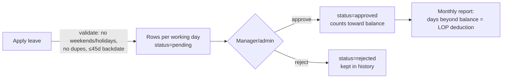

# HR — Leave · Attendance · WFH · Travel · Employees · KRA

All in `app.py`. Serves internal staff (the `employees` table). FY = **April–March**.

---

## Leave

**Apply:** `/apply-leave` (`apply_leave`, ~L4135), `/apply-late-leave` (backdate ≤45 days, ~L4278).
**Approve/reject:** `/approve/<id>` + `/reject/<id>` (manager, ~L5008/5052); `/admin/approve-leave/<id>` + `/admin/reject-leave/<id>` (admin, ~L6555/6600).
**Modify/cancel:** `/modify-leave/<id>` (pending only), `/edit-leave/<id>` (admin, any status), `/request-cancel-leave/<id>` (request cancel of approved), `/cancel-leave/<id>`, `/retrieve-leave/<id>` (un-reject), `/decline-cancel-request/<id>`.

**Table `leave_records`:** `employee_id`, `leave_type` (annual/sick/casual), `leave_date`,
`days` (0.5 for half), `day_portion` (full/first_half/second_half), `status`
(pending/approved/rejected/cancelled), `is_late`, `leave_group_id` (groups a multi-day
application), `approved_by/at`, `cancel_requested*`, `original_id`/`modification_reason` (audit).

### Leave balance / accrual (the tricky bit)
- Entitlement **25/year**: Annual 13 (+`employees.carry_forward`), Sick 6, Casual 6.
- **Monthly accrual: April = 3 days, all other months = 2** (totals 25).
- Helpers (top of app.py ~L186–430): `get_monthly_alloc`, `leave_type_balances`,
  `calculate_monthly_balance`, `leave_month_figures`.
- **Deficit does NOT carry** — each month `available = carried_in + monthly_alloc`; days taken
  beyond `available` are **LOP (Loss of Pay)** → a salary deduction, and do **not** reduce the
  type balance. `carried_out = max(0, available)`. (An earlier bug clamped this and gave
  over-takers free leave — fixed; see `reference_leave_deduction`.)

### Monthly salary-deduction report
`/admin/monthly-report` (~L6248) + `/download` (xlsx). Per employee: monthly alloc, balance
start/available, days taken, **deduction = max(0, taken − available)**. Uses
`leave_month_figures()` (single-month). Full-year per-type report: `/admin/employee-leave-report`
(uses `leave_type_balances()`).

## Holidays
`/admin/holidays` (add/delete, ~L6356), `/holidays` (employee read-only). Table `holidays`
(`holiday_date`, `name`, `holiday_type`). Used to skip working-day calc in leave.

## WFH
`/wfh/apply`, `/wfh/my-requests`, `/wfh/approvals`, `/wfh/approve/<id>` (~L8743+). Table
`wfh_requests`. **WFH takes precedence over leave** — applying WFH auto-cancels overlapping
approved/pending leaves.

## Official Travel
`/official-travel/apply|my-requests|approvals|approve|reject|cancel` (~L9009+). Table
`official_travel_requests` (city from `cities` dropdown, description required, ≤45d backdate).
Auto-cancels overlapping leaves; blocked by overlapping WFH.

## Attendance
`/admin/upload-attendance` (~L30317) — bulk import biometric punch (.xls/.xlsx, two formats:
flat table or raw fingerprint; matches by `emp_code`). `/time-log` (~L30564) — monthly calendar
view. `/api/attendance/toggle-manual-present` — HR override. `/admin/send-attendance-report[s]`
— email. Table `attendance_logs` (UNIQUE `(employee_id, attendance_date)`; re-upload
**overwrites**; `manual_present` flag).

## Employees master
`/admin/manage-employees` (~L6052), `/admin/employee/<id>` (detail), `/admin/employee/<id>/edit`
(~L5752), `/admin/employee/<id>/upload-photo`, `/admin/delete-employee/<id>`. Table `employees`:
`name`, `emp_code`, `email`, `phone`, `department`, `designation`, `joining_date`,
`reporting_to` (manager id), `carry_forward`, `is_admin`, `is_active`, `photo_url`,
`employment_status` (active/…/resigned/terminated), exit fields, `late_leave_count`.

## KRA (Key Result Areas)
`/kra/*` (~L11218–11923). Admin builds **templates** (`kra_templates` + `kra_template_items`
grouped by `kra_categories`: Target, Knowledge, Customer Handling, HR, Extra Mile,
Interpersonal Skill), **assigns** them per FY (`kra_assignments`), then employee + manager rate
monthly (`kra_monthly_ratings` — separate `employee_rating`/`manager_rating` 0–10, independent
submit flags) with notes (`kra_monthly_notes`). Report: `/kra/admin/report`, `/kra/report`.
FY April–March like leave.

## Gotchas
- FY starts **April**; April accrues 3 leave days, other months 2.
- LOP days deduct salary but never reduce the leave-type balance.
- Attendance re-upload for a date **overwrites** prior rows (UNIQUE constraint).
- WFH/Travel auto-cancel overlapping leaves (leave never wins).
