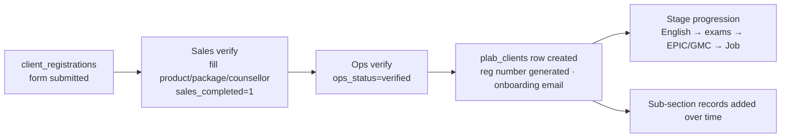

# Operations

The biggest section (~158 routes). Manages **client delivery across 6 pathways**
after a client is verified. Code is split between `app.py` (PLAB, legacy) and
`routes/operations/*.py` (all other pathways + sub-sections), wired by
`register_operations_modules(app)` in `routes/operations/__init__.py`.

**Pathways:** PLAB · Australia (AMC) · Consulting · Portfolio · UAE · Training.

---

## Structure

```mermaid
flowchart TD
    D[/operations<br/>main dashboard: 6 pathway cards/] --> P1[Pathway dashboard<br/>e.g. /operations/plab-pathway-dashboard]
    P1 --> L[Pathway client LIST<br/>/operations/{pathway}/clients]
    L --> DET[Client DETAIL page<br/>/operations/{pathway}/client/&lt;id&gt;]
    DET --> S[sections dict: one card per<br/>ops_* sub-section]
    S --> SUB[Each sub-section: list · detail · add · edit]
```

- **Main dashboard** `/operations` (`ops_main_dashboard`, app.py ~16628) — cards per
  pathway, gated by `has_section_permission(user, '{pathway}_pathway','dashboard','view')`.
- **Per-pathway list + detail** routes live in `routes/operations/{australia,consulting,uae,portfolio,training}.py`; **PLAB's live in app.py** (`ops_plab_dashboard`, ~19672) — the legacy exception.
- **Client detail page** builds a `sections` dict via a local `fetch()`/`_plab_section()`
  helper that pulls pathway-scoped rows from each `ops_*` table. Templates:
  `ops_plab_dashboard.html`, `ops_{pathway}_client_detail.html`.

## The master client table — `plab_clients`

Despite the name it holds **all pathways** (`pathway` column, added via ALTER). ~80 columns. Key ones:

| Group | Columns |
|---|---|
| Identity | `id`, `registration_number` (UNIQUE), `pathway`, `product_id`, `plan_type`, prefix/first/last name, mobile, email |
| Money | `package_amount`, `discount_allowed`, `final_package`, `inst1..4_amount/date`, `total_paid` |
| Status | `account_status` (In Process / On Hold / Dropped / Completed), `current_stage`, `joined_stage` |
| Sales | `counsellor`, `counsellor_email`, `counsellor_number`, `lead_source` |
| Meta | `registration_date` (TEXT), `created_at`, `created_by` |

## The `ops_*` sub-section tables

All scoped by `COALESCE(pathway,'plab') = ?`. Each has a matching module + list/detail/add/edit:

`ops_call_notes` · `ops_payments` · `ops_coaching` (training) · `ops_test_bookings` (exams)
· `ops_epic_registration` · `ops_gmc_registration` · `ops_amc_registration` ·
`ops_academic_details` · `ops_research_publication` · `ops_online_subscriptions` ·
`ops_online_courses` · `ops_webinars_conferences` · `ops_mentorship` · `ops_job_stage` ·
`ops_english_logins` · `ops_uk_visa_travel` · `ops_uk_cab_bookings` · `ops_uk_observerships`
· `ops_ngo_activities` (cross-pathway) · UAE-only: `ops_self_assessment`,
`ops_eligibility_letter`, `ops_data_flow`.

**Module naming:** `{au,cs,uae,pf,tr}_{subsection}.py` (e.g. `cs_payments.py` = Consulting
payments). See [MAP.md](../MAP.md) for the full module list.

## Client lifecycle



**Verification queues** (`routes/verification_queues.py`):
- `/verifications/sales` — registrations awaiting sales to fill balance/plan; + internal transfers awaiting sales.
- `/verifications/ops` — `sales_completed=1 AND ops_status≠'verified'` → ops verifies → **auto-creates the `plab_clients` row** + onboarding email/notify.

**Internal transfers** (`internal_transfers` table) — move a client between pathways
("Add to Training" via `cross_pathway_add.py`): `status='approved'` →
`completion_stage` `awaiting_sales` → `awaiting_ops` → `completed`.

**Installment approvals** (`installment_approvals`) — admin approves a "Received"
installment → posts an `ops_payments` row (`source='auto'`).

## Call Notes → Reports (all pathways)

`routes/operations/call_notes_report.py` — a **shared** report engine, one route per
pathway (`/operations/{pathway}/call-notes/report`). Filters by date range + team member;
breakdowns by member / stage / contact type; CSV export. See
[reference: ops call-notes ordering].

## Gotchas

- **`ops_call_notes.call_date` is TEXT** (often blank) — order by `created_at`/`id`, never
  `call_date`. The report uses an "effective date" (valid `YYYY-MM-DD` call_date else `created_at`).
- **Pathway scoping is opt-in** — always `COALESCE(pathway,'plab')`.
- **PLAB is the legacy exception** — its list/detail are in app.py, not a module.
- **Endpoint names are flat** (via `app.add_url_rule`, not Blueprints) to protect 110+
  `url_for()` call sites — keep new endpoints uniquely named `ops_{pathway}_{thing}`.
- **When adding/changing an ops section, wire ALL factors:** Access Master catalogue + route
  map, sidebar, dashboard card, lookups. Admins bypass perms so gaps are invisible to the
  founder — test as a non-admin.
- Reg-number prefixes per pathway (core/registration.py): PLAB `GCUKIP`, Australia
  `GCAUSIP`, UAE `GCUAE`, Consulting `GCCSS`, Portfolio `GCPPLUS`, Training `GCTRN`.
