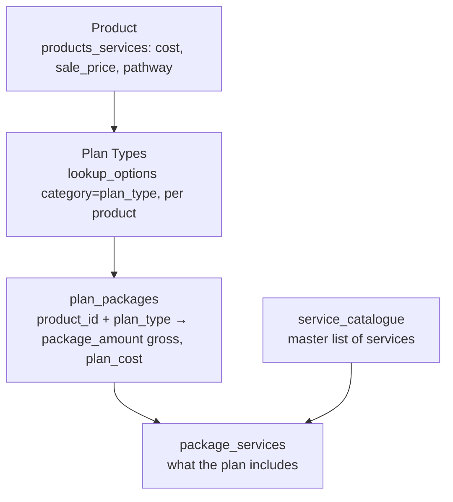

# Products & Packages

Two layers: **Products & Services** (the company catalogue with economics — see also
[finance.md](finance.md)) and **Plans & Services** (per-product plan-type packages + what each
includes). In `app.py` (~L1340–1560, ~L28980+); admin at `/products` and `/admin/packages`.

---

## Layers

## Tables

| Table | Role |
|---|---|
| `products_services` | the product (cost / sale_price / currencies / pathway) — see finance |
| `lookup_options` (category `plan_type`) | plan types per product (`product_name`, `pathway`) |
| `plan_packages` | **per (product_id, plan_type):** `package_amount` (gross/sale), `plan_cost` (cost), `summary`, `is_active`, `sort_order` |
| `service_catalogue` | master list of deliverable services |
| `package_services` | which services a plan_package includes (verbatim contract descriptions, per-service budget, delivery stage) |

There is **no separate "sales revenue" column** — Sales Revenue is computed `gross − cost`
(`package_amount − plan_cost`). This drives the [Actual Sales Revenue report](sales.md).

## Where it's used

- **Admin definition:** `/admin/packages?product_id=<id>` — define plan packages + attach services.
  `get_plan_package_amount(conn, product_id, plan_type)` reads the amount.
- **Sales closure form:** Plan Type cascades from Product; the plan's package pre-fills the amount.
- **Client portal + Ops profiles (Phase 2):** the plan's included services are shown to the client
  and ops team; delivery-stage = the pathway's `current_stage`.

## Plan Type cascade

`/sales/api/product/<id>` (`sales_product_info`) returns `plan_types` from `lookup_options`
(category='plan_type', filtered by product_name). The chosen plan-type row's `pathway` is used for
the client's pathway assignment. `seed_pathway_product_plans()` back-fills the
(pathway, product, plan-types) mapping idempotently at boot.

## Gotchas
- `plan_packages.plan_cost` is **0 for all plans until entered** in the Packages admin → until then
  the Revenue Report's Sales Revenue = package (no cost subtracted).
- Plan types are matched to products by **product_name string** (not id) in the cascade — mistagged
  products (plab vs consulting) cause wrong plan lists.
- Reg-number prefix comes from the plan-type's pathway (consulting `GCCSS`, training `GCTRN`, etc.).
- Pending: task #23 (seed AMC Consulting plans/services — needs founder data), #22 (nav + Access
  Master section for Packages).
