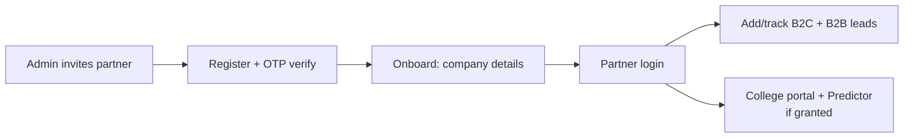

# Partners & College

Two related public/affiliate-facing areas.

---

## Partners (in `app.py` ~L700–929, ~L27700–29000)

A **partner portal** for referral/recruitment partners (agencies, schools) to manage leads.

**Login/onboard:** `/partner-login` (email + password), invite → `/partner/register/<token>` →
`/partner/register/send-otp` + `/verify-otp` (OTP) → `/partner/onboard/<token>`.
**Partner-facing:** `/partner/dashboard`, `/partner/profile`, `/partner/leads` (+ `/add`),
`/partner/b2b-leads` (+ `/add`).
**Admin-facing:** `/partners` (list), `/partners/dashboard`, `/partners/add`, `/partners/<id>/edit`,
`/partners/invitations`, `/partners/leads` + `/partners/b2b-leads` (all partner leads).

**Tables:** `partners` (company, contact, email, password_hash, partner_type, status),
`partner_products` (which products they sell), `partner_team_members`, `partner_leads` (B2C student
leads), `partner_b2b_leads` (school/college leads), `partner_lead_activities` (audit),
`partner_invitations`, `partner_otps`.

**Permissions:** partner access is gated per-section via `user_section_permissions` with
`subject_type='partner'` (`get_partner_visible_sections`). Sub-sections: dashboard, student_leads,
b2b_leads, team, products, commissions, reports, **college_portal**, **medical_predictor**, profile.

---

## College module (self-contained `college/` folder)

Extracted from app.py into `college/` and wired via `register_college(app)` (uses
`app.add_url_rule`, not Blueprints; auto-seeds colleges + creates tables at boot). Structure:
`college/routes/{portal,predictor,neetpg,partner}.py`, `college/data/tables.py`, `college/utils.py`,
`college/templates/college/*.html`.

### College Portal (`portal.py`) — admin CRUD
Directory of Indian + international (Russian, etc.) medical colleges with courses + fee structures.
`/colleges` (list, filters), `/colleges/<slug>` (profile), `/colleges/admin/add|edit|delete`,
`/colleges/admin/.../course/add`, `.../fee/add`, `/colleges/admin/import-all` (seed).
Tables: `colleges` (~40 cols incl. INR economics), `college_courses`, `college_fee_structure`,
`countries`. Live FX INR conversion for international fees (`college/utils.py`).

### Medical Predictor (`predictor.py`) — MBBS cut-off
`/medical-predictor` (admin), `/api/predictor/{filters,search,import}`. Searches `mbbs_cutoffs`
(year, institute, quota, category, round1/2/3 ranks) → matching colleges (link to profile). Also
partner-facing at `/partner/medical-predictor`.

### NEET-PG portal (`neetpg.py`) — public PDF portal
Public landing `/neet-pg-2025`: published NEET-PG / DNB PDFs (cut-off / stipend-bond / MCC profile),
lead capture + **WhatsApp OTP via Infobip**, document requests, download/view (counter). Admin
`/admin/neetpg-pdfs` (upload, publish, schedule, WhatsApp blast, leads export xlsx).
Tables: `neetpg_pdfs` (file_data BYTEA, is_published, auto_schedule), `neetpg_leads`,
`neetpg_requests`, `neetpg_page_visits`.

> **Note on domains:** the public **NEET *Rank* Predictor on `goocampus.in`** is a separate
> marketing site. This module is NEET-**PG** (postgrad) PDFs + MBBS-UG cut-off data, served on the
> portal domain. Don't conflate them.

**Other public country landing pages** (lead capture into `*_leads` tables): `/germany-pathway`,
`/russia`, `/georgia`, `/vietnam`, `/uzbekistan`, `/jss-mauritius` — live in app.py.

## Gotchas
- College module auto-seeds colleges at boot if empty (Russian + Indian JSON).
- FX rates cached; international fees convert live.
- Partner college/predictor access needs the `partner_portal`/`college_portal` +
  `medical_predictor` grants.
