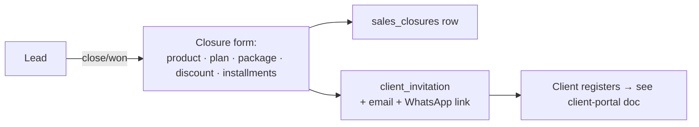

# Sales

Leads → closures → the client invitation that starts the whole client lifecycle. Plus the sales
team dashboard, targets, verification queues, and the Actual Sales Revenue report. Mostly in
`app.py` (~L26200–27600); sidebar `sales_sidebar_base.html`; role-aware (see
[access-permissions.md](access-permissions.md)).

---

## What's here

| Area | URL | Notes |
|---|---|---|
| **Dashboard** | `/sales` | rep → personal "My Sales" (`sales_my.html`); admin/manager → team overview (`sales_crm_dashboard.html`). Per-member snapshot via `_get_sales_member_snapshot()` |
| **Member drill-down** | `/sales/member/<id>` | one member's targets/achieved/leads |
| **Leads** | `/sales/leads` | the pipeline: `sales_leads` + `sales_lead_stages` (is_won/is_lost) |
| **Add closed client** | `sales_leads_add` / lead close | the closure form (`sales_lead_form.html`) — the key form (below) |
| **Closures** | `/sales/closures` | `sales_closures` (revenue/cost/margin, **manually entered** at close) |
| **Targets** | `/sales/targets` | `sales_targets` (target_margin per member/period) |
| **Call reports** | `/sales/calls` | `sales_call_logs` |
| **Revenue Report** | `/sales/revenue-report` | **Actual Sales Revenue by team member** (below) |
| **Sales Team** | `/sales/team` | `sales_team` roles (rep/manager) |
| **Lead Stages** | `/sales/stages` | configurable pipeline stages |
| **Verification** | `/verifications/sales`, `/verifications/ops` | see [operations.md](operations.md) |

## The closure form → client invitation (the spine)

`sales_lead_form.html` (route in app.py ~L26580). On close/won:
1. Captures product, **plan type** (cascades from product), **package_amount** (ex-GST base),
   **discount_allowed**, **final_package** (= package − discount), counsellor, lead source,
   installment breakups (entered incl-GST, stored ÷1.18 as base).
2. Writes a `sales_closures` row (revenue/cost/margin — *manual*, drives the dashboard "achieved").
3. **Auto-creates a `client_invitation`** and sends the email + WhatsApp registration link
   (`_send_client_invite_wa`). This kicks off the client lifecycle.

**AMC Consulting + AMC 1 combined:** if product = AMC Consulting, a toggle "Include AMC MCQ (AMC 1)?"
adds a second Training package + installments → on register-from-invite, a **second**
`client_registrations` row is created in the Training pathway (own `GCTRN` reg number). Consulting
commits first (transaction safety).

## Actual Sales Revenue report (`/sales/revenue-report`)

Per counsellor, from `plab_clients` (package>0), joined to `plan_packages` on
`(product_id, plan_type)`:
- **Sales Revenue = package − plan cost** · **Actual Sales Revenue = Sales Revenue − discount =
  package − cost − discount**.
- Cost lives ONLY in the plan definition; `final_package` (= package − discount) has no cost.
- Filters: date range on `registration_date` + by-whom. Columns: clients, package, cost, discount,
  Sales Revenue, Actual Sales Revenue + CSV-ready. (Plan costs are 0 until entered in Packages.)

## Gotchas

- `sales_closures` (dashboard "achieved") is **manually typed** and **separate** from the client's
  real package/discount economics — two different revenue numbers. The Revenue Report uses the real
  client data.
- Plan Type **cascades from Product** via `/sales/api/product/<id>` (matched on product_name);
  some products were mistagged (plab vs consulting) historically.
- Role scoping: reps see only their own leads/closures; managers see reports; admins/viewers see all.
